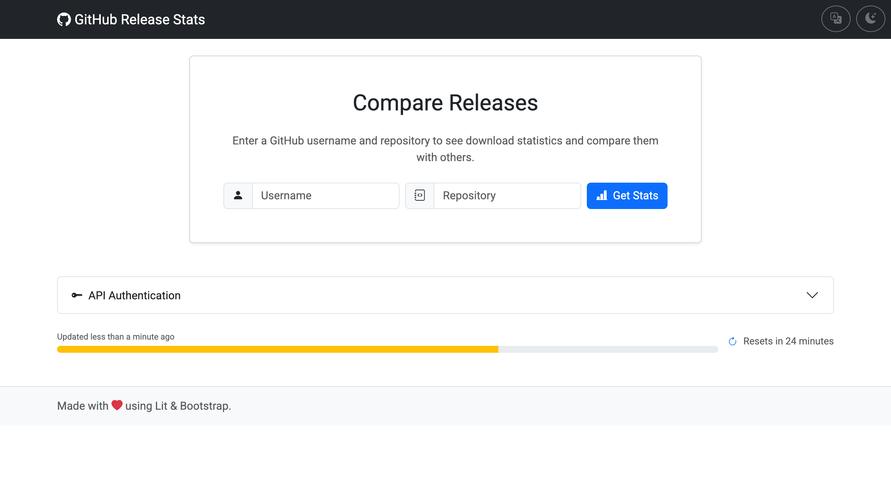

# GitHub Release Stats

A web application to visualize and compare download statistics, star history, open issues, and other key metrics for GitHub repositories.

## 🚀 Live Demo

**[Check out the live application here!](https://timmaurice.github.io/github-release-stats/)**

## ✨ Features

### Data Visualization

- **Multi-Repository Comparison:** Compare key metrics for multiple repositories side-by-side.
- **Interactive & Dynamic Charts:**
  - **Downloads per Release:** Track download counts for each release.
  - **Cumulative Star History:** Visualize the growth of repository stars over time.
  - **Open Issues History:** See the trend of open issues.
  - **Total Asset Size:** Monitor the size of release assets over time.
- **Dynamic Chart Metric:** The chart automatically updates to visualize the metric you sort by in the summary table.
- **Customizable Tables:** Toggle the "Total Downloads" column on or off to focus on the metrics you care about most.
- **Filter Dependabot PRs:** Exclude automated Dependabot pull requests for a cleaner view of active contributions.
- **Linear & Logarithmic Scales:** Switch the chart's Y-axis scale for better data analysis.
- **Zoom & Pan:** Zoom in on specific time ranges within the charts.

### Data Management

- **Save & Manage Sets:** Save your comparison sets and easily load them later.
- **Pinned Dashboard:** Pin your favorite repository set so it automatically loads whenever you visit the app.
- **Shareable URLs:** The URL automatically updates as you add or reorder repositories, making it easy to share your exact comparison.
- **Export to CSV:** Download the summary table data for offline analysis.
- **Copy as Markdown:** Instantly copy the comparison table in Markdown format, ready to paste into GitHub issues or documentation.
- **Detailed Repository Reports:** Download a comprehensive Markdown report for any single repository, including its top releases and recent activity.

### Performance

- **IndexedDB Caching:** Historical data is cached locally to drastically speed up page loads and preserve your GitHub API rate limit.

### User Experience

- **Drag & Drop Reordering:** Easily reorder repositories by dragging their pills.
- **Responsive Design:** A clean and intuitive interface that works on both desktop and mobile.
- **Settings Modal:** A centralized hub to manage your preferences, including Language, Theme, API Authentication, and Table Options.
- **Light, Dark, & Auto Modes:** Automatically detect your system preference with an "Auto" mode, or manually switch between Light and Dark themes.
- **Internationalization (i18n):** Available in English, German, and Simplified Chinese.
- **GitHub API Authentication:** Enter a Personal Access Token to increase the API rate limit from 60 to 5,000 requests/hour.

### Progressive Web App (PWA)

- **Installable:** Install the application directly to your device (Desktop or Mobile) for a native app experience.
- **Offline Support:** Service workers cache core assets to ensure the app loads quickly.
- **Custom Window Controls:** Uses the Window Controls Overlay API for a seamless, native-looking title bar on Desktop.
- **Protocol Handler:** Open the app automatically via custom `web+ghstats://` links (e.g., `web+ghstats://microsoft/vscode`).

## 🛠️ Getting Started

1.  **Enter a Repository:** Start by typing a GitHub username (e.g., `microsoft`) and repository name (e.g., `vscode`).
2.  **Add More Repositories:** Use the "Add Repository" form to add more projects to the comparison.
3.  **Analyze the Data:**
    - Click on the headers in the summary table to sort the data. The chart above will dynamically update to visualize the sorted metric.
    - Use the toggle buttons to switch the chart's scale between `Linear` and `Logarithmic`.
    - Click on the accordion headers to view a detailed release list for each repository.
4.  **Manage Your View:**
    - Drag and drop the repository pills to reorder them.
    - Save your current set of repositories for later, or load a previously saved set.
    - Click "Copy Link" to get a shareable URL of your current comparison.

### API Rate Limits

By default, the GitHub API has a rate limit of 60 requests per hour for unauthenticated users. To increase this limit, you can provide a GitHub Personal Access Token.

1.  Click the gear icon in the top-right toolbar to open the **Settings** modal.
2.  Scroll down to the "API Authentication" section, paste your token into the input field, and click "Save".
3.  The token is stored securely in your browser's `localStorage` and is only sent to the GitHub API.

## 💻 Development

Want to contribute or run the project locally? Check out our [Development Guide](./DEVELOPMENT.md) for instructions on setting up the repository, running tests, and understanding the architecture.

## ⚙️ Tech Stack

- **Framework:** Lit
- **Language:** TypeScript
- **Bundler:** Vite
- **PWA:** vite-plugin-pwa
- **Styling:** Bootstrap 5, Bootstrap Icons & SASS
- **Charting:** Chart.js, `chartjs-adapter-date-fns`, `chartjs-plugin-zoom`
- **GitHub API:** Octokit.js
- **Drag & Drop:** SortableJS
- **Linting & Formatting:** ESLint (Flat Config) & Prettier

## 📄 License

This project is licensed under the MIT License. See the `LICENSE` file for details.
